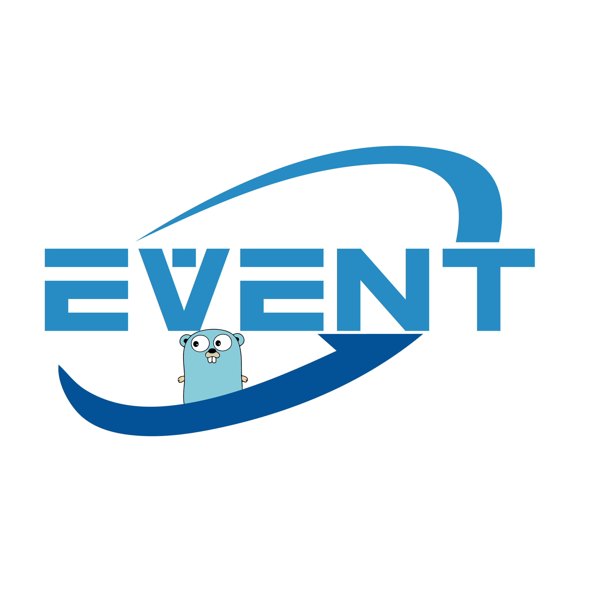

<p align="center">

<br><br>
<a title="Build Status" target="_blank" href="https://github.com/cheng-zhongliang/event/actions?query=workflow"></a>
<a title="Codecov" target="_blank" href="https://codecov.io/gh/cheng-zhongliang/event"></a>
<a title="Supported Platforms" target="_blank" href="https://github.com/cheng-zhongliang/event"></a>
<a title="Go Report Card" target="_blank" href="https://goreportcard.com/report/github.com/cheng-zhongliang/event"></a>
<a title="Doc for event" target="_blank" href="https://pkg.go.dev/github.com/cheng-zhongliang/event"></a>
<a title="License" target="_blank" href="https://github.com/cheng-zhongliang/event/blob/master/LICENSE"></a>
<a title="Release" target="_blank" href="https://github.com/cheng-zhongliang/event/releases"></a>
<a title="Tag" target="_blank" href="https://github.com/cheng-zhongliang/event/tags"></a>
<a title="Require Go Version" target="_blank" href="https://github.com/cheng-zhongliang/event"></a>
<a title="Mentioned in Awesome Go" target="_blank" href="https://github.com/avelino/awesome-go#networking"></a>
<a title="Stars" target="_blank" href="https://starchart.cc/cheng-zhongliang/event"></a>
</p>

`event` is a network I/O event notification library for Go. It uses [epoll](https://en.wikipedia.org/wiki/Epoll) and [kqueue](https://en.wikipedia.org/wiki/Kqueue) to poll I/O events that is fast and low memory usage. It works in a similar manner as [libevent](https://github.com/libevent/libevent).

The goal of `event` is to provide a `BASIC` tool for building high performance network applications.

*Note: All development is done on a Raspberry Pi 4B.*

## Features

- Supports Read/Write/Timeout events
- Flexible timer event and ticker event
- Supports event priority
- Edge-triggered option
- Simple API
- Low memory usage

## Getting Started

### Installing
To start using `event`, just run `go get`:

```sh
$ go get -u github.com/cheng-zhongliang/event
```

### Event

- `EvRead` fires when the fd is readable.
- `EvWrite` fires when the fd is writable.
- `EvTimeout` fires when the timeout expires.

When the event is triggered, the callback function will be called.

### Option

The event is one-shot by default. If you want to persist, you can set the `EvPersist` option.

```go
ev := event.New(base, fd, event.EvRead|event.EvPersist, callback, arg)
```

The event is level-triggered by default. If you want to use edge-triggered, you can set the `EvET` option.

```go
ev := event.New(base, fd, event.EvRead|event.EvET, callback, arg)
```

### Read/Write/Timeout

These events can be used in combination.

```go
base := event.NewBase()
ev := event.New(base, fd, event.EvRead|event.Timeout|event.EvPersist, callback, arg)
ev.Attach(time.Second)
```

When the fd is readable or timeout expires, this event will be triggered.

### Timer

The timer is a one-shot event that will be triggered after the timeout expires.

```go
base := event.NewBase()
ev := event.NewTimer(base, callback, arg)
ev.Attach(time.Second)
```

### Ticker

The ticker is a repeating event that will be triggered every time the timeout expires.

```go
base := event.NewBase()
ev := event.NewTicker(base, callback, arg)
ev.Attach(time.Second)
```

### Priority

When events are triggered together, high priority events will be dispatched first.

```go
ev := event.New(base, fd, event.EvRead|event.EvET, callback, arg)
ev.SetPriority(event.HPri)
```

### Usage

Example echo server that binds to port 1246:

```go
package main

import (
	"syscall"

	"github.com/cheng-zhongliang/event"
)

func main() {
	base, err := event.NewBase()
	if err != nil {
		panic(err)
	}

	fd := socket()
	ev := event.New(base, fd, event.EvRead|event.EvPersist, accept, base)
	if err := ev.Attach(0); err != nil {
		panic(err)
	}

	if err := base.Dispatch(); err != nil && err != syscall.EBADF {
		panic(err)
	}

	syscall.Close(fd)
}

func socket() int {
	addr := syscall.SockaddrInet4{Port: 1246, Addr: [4]byte{0, 0, 0, 0}}
	fd, err := syscall.Socket(syscall.AF_INET, syscall.SOCK_STREAM, syscall.IPPROTO_TCP)
	if err != nil {
		panic(err)
	}
	if err := syscall.Bind(fd, &addr); err != nil {
		panic(err)
	}
	err = syscall.Listen(fd, syscall.SOMAXCONN)
	if err != nil {
		panic(err)
	}
	return fd
}

func accept(fd int, events uint32, arg interface{}) {
	base := arg.(*event.EventBase)

	clientFd, _, err := syscall.Accept(fd)
	if err != nil {
		panic(err)
	}

	ev := event.New(base, clientFd, event.EvRead|event.EvPersist, echo, nil)
	if err := ev.Attach(0); err != nil {
		panic(err)
	}
}

func echo(fd int, events uint32, arg interface{}) {
	buf := make([]byte, 0xFFF)
	n, err := syscall.Read(fd, buf)
	if err != nil {
		panic(err)
	}
	if _, err := syscall.Write(fd, buf[:n]); err != nil {
		panic(err)
	}
}
```

Connect to the echo server:

```sh
$ telnet localhost 1246
```
