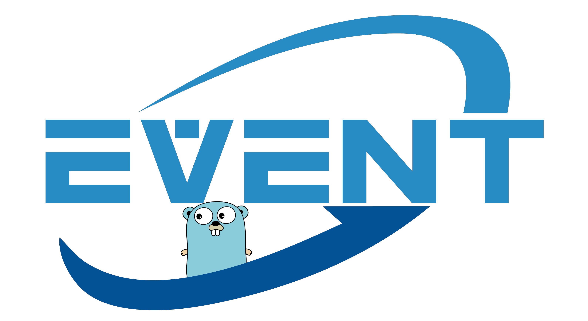

 

`unicorn` is a network I/O event notification library for Go.

`unicorn` adopts reactor architecture.

`unicorn` supports epoll on Linux ~~and kqueue on Unix~~.

*Note: Unicorn is more suitable for beginners who want to learn I/O multiplexing.*

*Note: All development is done on a Raspberry Pi 4B.*

## Features

- Simple API
- Standard reactor architecture
- Low memory usage
- Cross-platform
